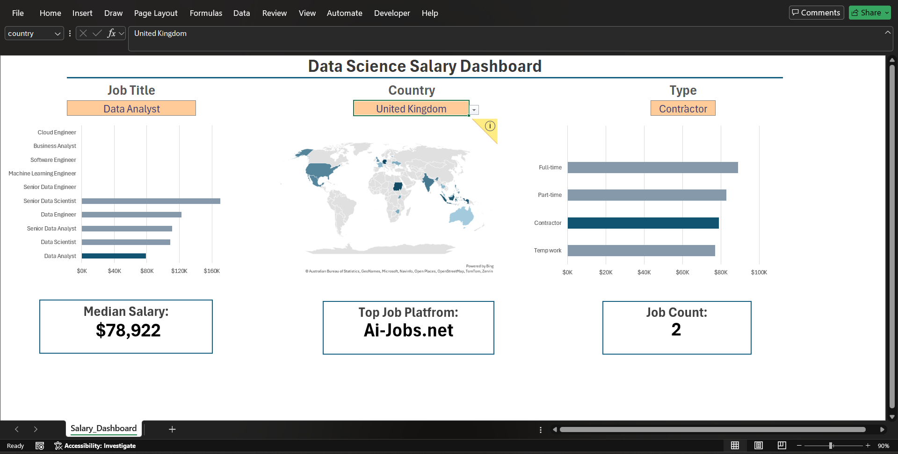
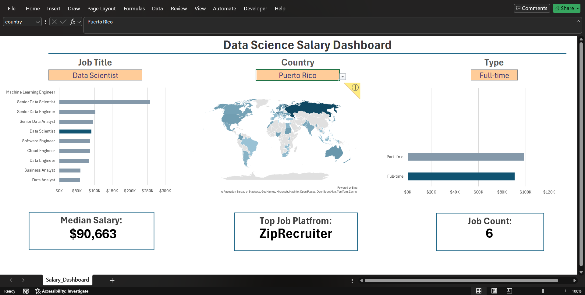
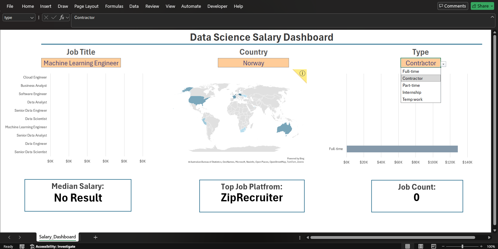

# 📊 Salary Analytics Dashboard (Excel)

An interactive salary analytics dashboard built entirely in **Microsoft Excel 2024 LTSC**, analyzing 32,000+ real-world data science job postings — without VBA or Power Pivot.

## 🎯 Project Overview

This dashboard lets users explore salary trends, hiring platforms, job availability, and required skills across countries and job types. Built as a hands-on exercise in advanced native Excel functions to simulate a real analytical tool a data analyst might deliver to stakeholders.

**Live filtering by:** Job Title · Country · Job Type

**Dashboard displays:**
- Median Salary
- Job Count
- Highest Paying Countries (Map Chart)
- Salary by Job Title
- Top Hiring Platform

## 🗂️ Dataset

~32,673 job postings including:
Job Title, Location, Country, Job Type/Schedule, Work From Home status, Yearly & Hourly Salary, Skills, Company/Platform, Health Insurance, Degree Requirement, Posting Date.

> Note: each row contains *either* a yearly or hourly salary, never both — this required conditional handling throughout the formulas.

## ⚙️ Excel Skills Used

**Lookup:** XLOOKUP, INDEX, MATCH
**Dynamic Arrays:** FILTER, SORT, UNIQUE, SEQUENCE
**Logical:** IF, IFS, IFERROR, IFNA
**Statistical:** MEDIAN, AVERAGE, COUNTIF, COUNTIFS, SUMPRODUCT
**Text:** TEXT, SUBSTITUTE, SEARCH, ISNUMBER, LEN, TEXTJOIN, TEXTSPLIT
**Date:** MONTH, HOUR, EOMONTH, CHOOSE
**Other:** Named Ranges (incl. Dynamic Named Ranges), Data Validation, Conditional Formatting (Data Bars), Log Transformations, Excel Tables & Structured References, Custom Number Formats

## 🖼️ Dashboard Preview

| Filter Example | Result |
|---|---|
| Data Analyst · United Kingdom · Contractor |  |
| *(add another filter combo)* |  |

## 🧠 Challenges Solved

- Understanding and applying **Boolean Arrays** for multi-condition logic
- Dynamic Arrays and the `#` spill reference operator
- Combining `FILTER` with multiple conditions
- Building text-search logic with `SEARCH` + `ISNUMBER`
- Using `SUMPRODUCT` for array-based aggregation
- Getting `MEDIAN` to work correctly inside a `FILTER`
- Debugging `#NUM!` and `#CALC!` errors
- Building dynamic Data Validation dropdowns
- Structured References inside Excel Tables
- Custom Number Formatting for cleaner KPI displays
- Log transformations (`LOG()`) to fix skewed chart scales

## 📈 Learning Outcomes

This project deepened my understanding of:
- Native Excel dynamic array formulas (no VBA/Power Pivot required)
- Building interactive, filter-driven dashboards from raw tabular data
- Real-world data cleaning and preparation using helper sheets
- Translating messy data into decision-ready visuals

## 📁 Files

- `Salary_Dashboard.xlsx` — main workbook
- `screenshots/` — dashboard preview images
- `dataset/data_source_info.md` — dataset details/source
- `docs/formulas_notes.md` — my own breakdown of key formulas used

## 📜 License

MIT License (see LICENSE file)

---
Part of my self-directed Data Analyst roadmap: SQL → **Excel** → Python → Statistics → Data Visualization